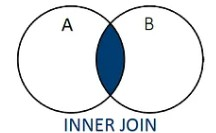
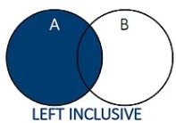
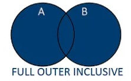

### SQLite Commands: JOINS and CROSS JOINS

#### Sample Tables: employees and mishmeret

```sql
CREATE TABLE employees (
    id INTEGER PRIMARY KEY,
    name TEXT NOT NULL,
    mishmeret_id INTEGER,
    FOREIGN KEY(mishmeret_id) REFERENCES mishmeret(id)
);

CREATE TABLE mishmeret (
    id INTEGER PRIMARY KEY,
    day TEXT NOT NULL
);
```

#### INSERT Sample Data

```sql
INSERT INTO employees (id, name, mishmeret_id) VALUES
(1, 'danny', NULL),
(2, 'yossi', 2),
(3, 'suzi', 5),
(4, 'shani', 6),
(5, 'shimon', 1),
(6, 'anatoly', NULL);

INSERT INTO mishmeret (id, day) VALUES
(1, 'Sunday'),
(2, 'Monday'),
(3, 'Tuesday'),
(4, 'Wednesday'),
(5, 'Thursday'),
(6, 'Friday');
```

### Types of JOINs

#### 1. INNER JOIN



Returns only rows with matching values in both tables

```sql
SELECT e.*, m.day
FROM employees e
INNER JOIN mishmeret m ON e.mishmeret_id = m.id;
```

**Result:**

| id | name   | mishmeret\_id | day      |
| -- | ------ | ------------- | -------- |
| 2  | yossi  | 2             | Monday   |
| 3  | suzi   | 5             | Thursday |
| 4  | shani  | 6             | Friday   |
| 5  | shimon | 1             | Sunday   |

#### 2. LEFT JOIN 



Returns all rows from the left table, and matched rows from the right table

```sql
SELECT e.*, m.day
FROM employees e
LEFT JOIN mishmeret m ON e.mishmeret_id = m.id;
```

**Result:**

| id | name    | mishmeret\_id | day      |
| -- | ------- | ------------- | -------- |
| 1  | danny   | NULL          | NULL     |
| 2  | yossi   | 2             | Monday   |
| 3  | suzi    | 5             | Thursday |
| 4  | shani   | 6             | Friday   |
| 5  | shimon  | 1             | Sunday   |
| 6  | anatoly | NULL          | NULL     |

#### 3. LEFT OUTER JOIN


Shows employees without any assigned mishmeret

```sql
SELECT e.*, m.day
FROM employees e
LEFT JOIN mishmeret m ON e.mishmeret_id = m.id
WHERE e.mishmeret_id IS NULL;
```

**Result:**

| id | name    | mishmeret\_id | day  |
| -- | ------- | ------------- | ---- |
| 1  | danny   | NULL          | NULL |
| 6  | anatoly | NULL          | NULL |

#### 4. FULL OUTER JOIN (Simulated)



Simulate using UNION of LEFT and RIGHT joins (note: RIGHT JOIN not supported in SQLite)

```sql
SELECT e.*, m.* from employees e
FULL JOIN mishmeret m ON e.mishmeret_id = m.id;
```

**Simulated Output (conceptually):**

| id   | name    | mishmeret\_id | day       |
| ---- | ------- | ------------- | --------- |
| 1    | danny   | NULL          | NULL      |
| 2    | yossi   | 2             | Monday    |
| 3    | suzi    | 5             | Thursday  |
| 4    | shani   | 6             | Friday    |
| 5    | shimon  | 1             | Sunday    |
| 6    | anatoly | NULL          | NULL      |
| NULL | NULL    | NULL          | Tuesday   |
| NULL | NULL    | NULL          | Wednesday |

#### 5. CROSS JOIN

Returns all possible combinations of employees and mishmeret days

```sql
SELECT e.id, e.name, m.id AS mishmeret_id, m.day AS mishmeret_day
FROM employees e
CROSS JOIN mishmeret m;
```

**Partial Result (6 employees × 6 days = 36 rows):**

| id | name    | mishmeret\_id | mishmeret\_day |
| -- | ------- | ------------- | -------------- |
| 1  | danny   | 1             | Sunday         |
| 1  | danny   | 2             | Monday         |
| 1  | danny   | 3             | Tuesday        |
| …  | …       | …             | …              |
| 6  | anatoly | 6             | Friday         |

---

### Bonus: Dice Table and All Combinations

Create a table to simulate rolling two dice:

```sql
CREATE TABLE dice (value INTEGER);

INSERT INTO dice (value) VALUES (1), (2), (3), (4), (5), (6);

SELECT d1.value AS die1, d2.value AS die2
FROM dice d1
CROSS JOIN dice d2;
```

**Partial Result (36 combinations):**

| die1 | die2 |
| ---- | ---- |
| 1    | 1    |
| 1    | 2    |
| 1    | 3    |
| …    | …    |
| 6    | 6    |

---

### Summary:

* Use **INNER JOIN** to find matches in both tables.
* Use **LEFT JOIN** to keep all left-side data.
* Use **CROSS JOIN** to produce all combinations.
* Simulate **FULL OUTER JOIN** with a union of LEFT and RIGHT (if supported).
* CROSS JOIN is helpful for generating possibilities, like dice rolls.
