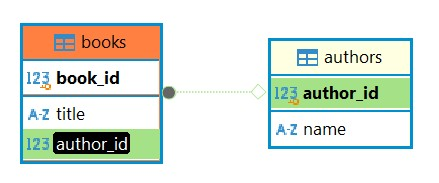
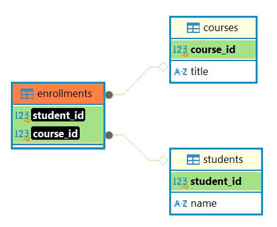

### SQLite Commands: Database Relationships (1:1, 1\:N, M\:N)

### 1. One-to-One Relationship (1:1)


#### Example: persons and passports

Each person can have only one passport, and each passport belongs to only one person.

```sql
CREATE TABLE persons (
    person_id INTEGER PRIMARY KEY,
    name TEXT
);

CREATE TABLE passports (
    passport_number TEXT PRIMARY KEY,
    person_id INTEGER UNIQUE NOT NULL,
    FOREIGN KEY (person_id) REFERENCES persons(person_id)
);
```


#### INSERT Sample Data

```sql
INSERT INTO persons (person_id, name) VALUES
(1, 'Alice'), (2, 'Bob'), (3, 'Charlie'), (4, 'Diana'),
(5, 'Ethan'), (6, 'Fiona'), (7, 'George'), (8, 'Hannah'),
(9, 'Isaac'), (10, 'Julia'), (11, 'Jessica'), (12, 'Jordan');

INSERT INTO passports (person_id, passport_number) VALUES
(1, 'A123456'), (2, 'B654321'), (3, 'C789012'), (4, 'D345678'),
(5, 'E901234'), (6, 'F567890'), (7, 'G432109'), (8, 'H876543'),
(9, 'I210987'), (10, 'J678901');
```

#### Show all people with passport

```sql
SELECT pe.*, p.passport_number
FROM passports p
INNER JOIN persons pe ON pe.person_id = p.person_id;
```

#### Show all people (with or without passport)

```sql
SELECT pe.*, p.passport_number
FROM persons pe
LEFT JOIN passports p ON pe.person_id = p.person_id;
```

### 2. One-to-Many Relationship (1\:N)


#### Example: authors and books

Each author can write multiple books, but each book has only one author.

```sql
CREATE TABLE authors (
    author_id INTEGER PRIMARY KEY,
    name TEXT
);

CREATE TABLE books (
    book_id INTEGER PRIMARY KEY,
    title TEXT,
    author_id INTEGER,
    FOREIGN KEY (author_id) REFERENCES authors(author_id)
);
```



#### INSERT Sample Data

```sql
INSERT INTO authors (author_id, name) VALUES
(1, 'George Orwell'), (2, 'J.K. Rowling'), (3, 'Stephen King'),
(4, 'Agatha Christie'), (5, 'Mark Twain'), (6, 'Jane Austen'),
(7, 'Ernest Hemingway'), (8, 'Isaac Asimov'), (9, 'Leo Tolstoy'),
(10, 'Haruki Murakami'), (11, 'Jules Verne');

INSERT INTO books (book_id, title, author_id) VALUES
(1, '1984', 1), (2, 'Animal Farm', 1),
(3, 'Harry Potter and the Sorcerers Stone', 2),
(4, 'Harry Potter and the Chamber of Secrets', 2),
(5, 'The Shining', 3), (6, 'It', 3),
(7, 'Murder on the Orient Express', 4),
(8, 'Adventures of Huckleberry Finn', 5),
(9, 'Pride and Prejudice', 6),
(10, 'The Old Man and the Sea', 7),
(11, 'Foundation', 8), (12, 'War and Peace', 9),
(13, 'Kafka on the Shore', 10);
```

#### Show all books with their author

```sql
SELECT b.*, a.name
FROM books b
JOIN authors a ON b.author_id = a.author_id;
```

#### Show authors without any books

```sql
SELECT a.*, b.*
FROM authors a
LEFT JOIN books b ON b.author_id = a.author_id
WHERE b.author_id IS NULL;
```

### 3. Many-to-Many Relationship (M\:N)


#### Example: students and courses via enrollments

Each student can enroll in many courses, and each course can have many students.

```sql
CREATE TABLE students (
    student_id INTEGER PRIMARY KEY,
    name TEXT
);

CREATE TABLE courses (
    course_id INTEGER PRIMARY KEY,
    title TEXT
);

CREATE TABLE enrollments (
    student_id INTEGER,
    course_id INTEGER,
    PRIMARY KEY (student_id, course_id),
    FOREIGN KEY (student_id) REFERENCES students(student_id),
    FOREIGN KEY (course_id) REFERENCES courses(course_id)
);
```



#### INSERT Sample Data

```sql
INSERT INTO students (student_id, name) VALUES
(1, 'Emma'), (2, 'Liam'), (3, 'Olivia'), (4, 'Noah'), (5, 'Ava'),
(6, 'William'), (7, 'Sophia'), (8, 'James'), (9, 'Mia'),
(10, 'Benjamin'), (11, 'Zipi');

INSERT INTO courses (course_id, title) VALUES
(1, 'Mathematics'), (2, 'History'), (3, 'Physics'), (4, 'Literature'),
(5, 'Biology'), (6, 'Chemistry'), (7, 'Art'), (8, 'Philosophy'),
(9, 'Computer Science'), (10, 'Economics'), (11, 'Java beans');

INSERT INTO enrollments (student_id, course_id) VALUES
(1, 1), (1, 2), (1, 3),
(2, 1), (2, 4), (2, 5),
(3, 2), (3, 3), (3, 6),
(4, 1), (4, 7), (4, 8),
(5, 4), (5, 9),
(6, 2), (6, 5), (6, 10),
(7, 3), (7, 4),
(8, 1), (8, 9),
(9, 5), (9, 10),
(10, 6), (10, 7), (10, 8);
```

#### Show all enrollments with student and course names

```sql
SELECT s.name, c.title
FROM enrollments e
INNER JOIN students s ON e.student_id = s.student_id
INNER JOIN courses c ON e.course_id = c.course_id;
```

#### Show number of courses each student is enrolled in

```sql
SELECT s.*, COUNT(e.course_id) AS course_count
FROM students s
LEFT JOIN enrollments e ON e.student_id = s.student_id
GROUP BY s.student_id, s.name;
```

#### Show number of students in each course

```sql
SELECT c.course_id, c.title, COUNT(e.student_id) AS student_count
FROM courses c
LEFT JOIN enrollments e ON e.course_id = c.course_id
GROUP BY c.course_id, c.title;
```

#### Show courses with no students enrolled

```sql
SELECT c.course_id, c.title
FROM courses c
LEFT JOIN enrollments e ON c.course_id = e.course_id
GROUP BY c.course_id, c.title
HAVING COUNT(e.student_id) = 0;
```

#### Show students not enrolled in any course

```sql
SELECT s.*
FROM students s
LEFT JOIN enrollments e ON s.student_id = e.student_id
WHERE e.course_id IS NULL;
```

### Summary:

* **1:1 (One-to-One)**: Use a `UNIQUE` foreign key to ensure a strict one-to-one match
* **1\:N (One-to-Many)**: Reference the "one" side using a foreign key in the "many" table
* **M\:N (Many-to-Many)**: Use a junction/association table with two foreign keys
