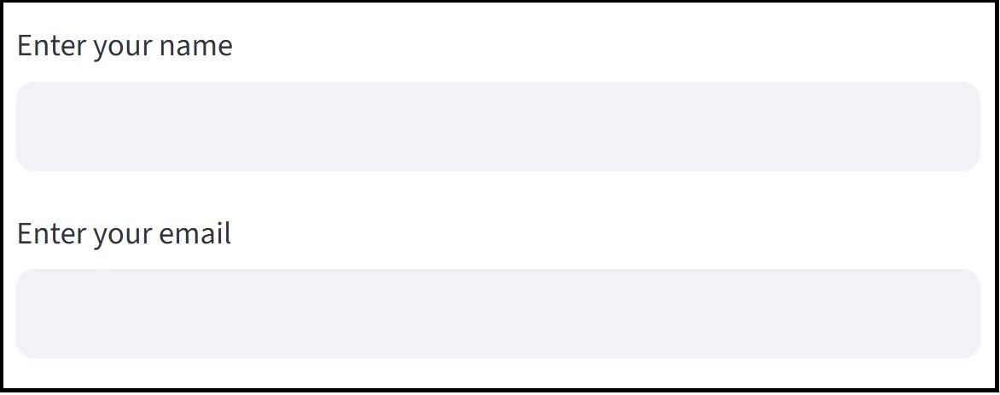
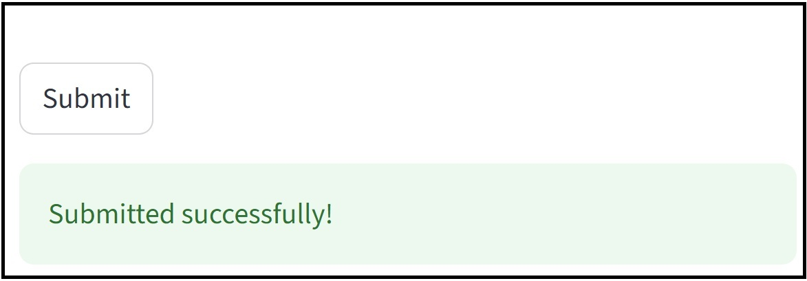
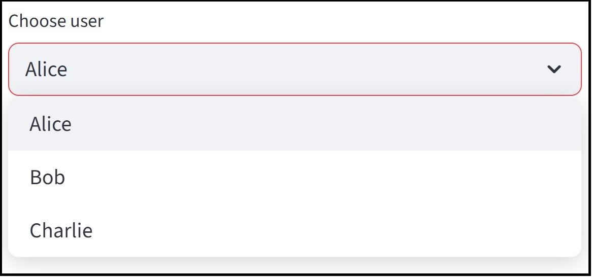
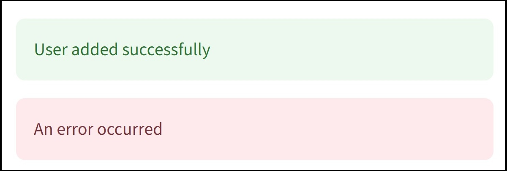
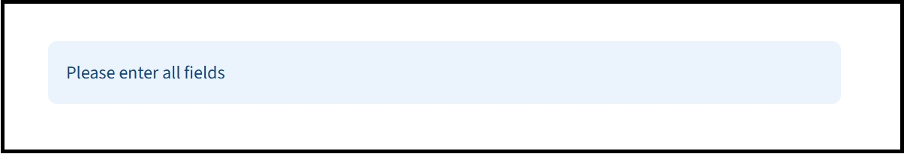
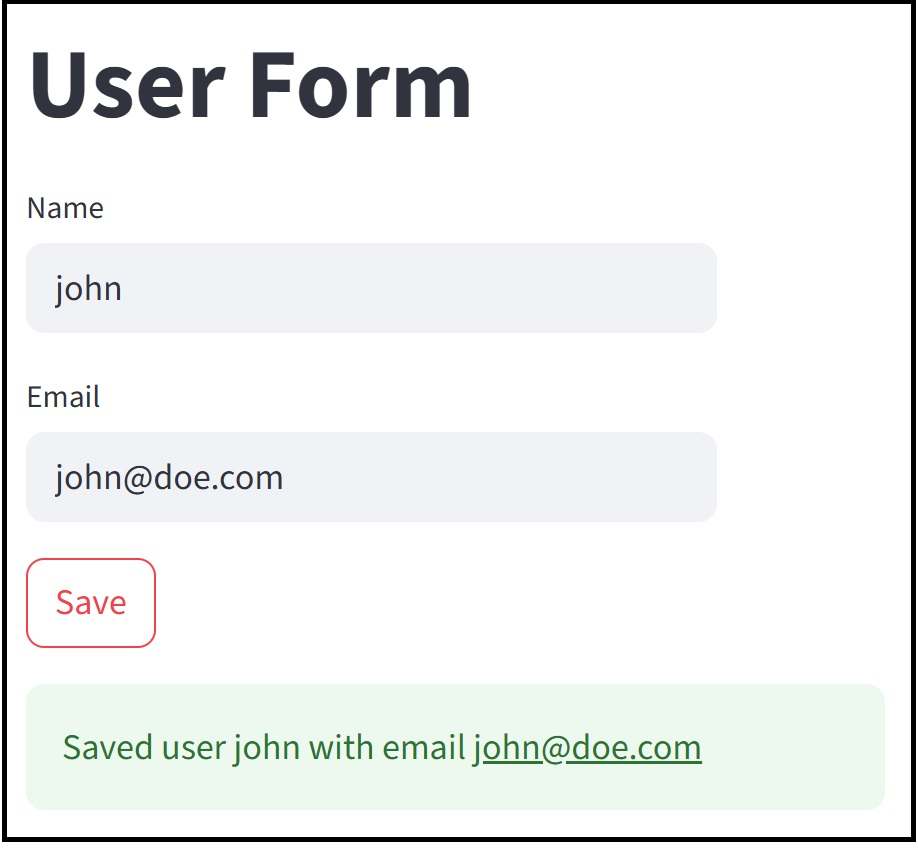

This page introduces [Streamlit](https://docs.streamlit.io/get-started/fundamentals/main-concepts#widgets) — an open-source Python library for building fast, interactive web apps with minimal code. It's ideal for turning Python scripts into data apps for dashboards, forms, and UIs.

**Why Use Streamlit?**

* Quickly turn any Python script into a web app
* No HTML, JS, or CSS needed
* Great for data scientists, analysts, and backend developers
* Supports widgets, charts, media, layout, and caching

### 2. Installing Streamlit

Install using pip:

```bash
pip install streamlit
```

To run a Streamlit app (e.g. `app.py`):

```bash
streamlit run app.py
```

### 3. Hello, Streamlit!

```python
import streamlit as st

st.title("Hello Streamlit")
st.write("Welcome to your first web app!")
```


### 4. Common Streamlit Components

#### `st.title()`

Sets a large title at the top:

```python
st.title("User Management System")
```

#### `st.subheader()`

Adds a smaller section title:

```python
st.subheader("Add a New User")
```

#### `st.text_input()`

Creates an input field:

```python
name = st.text_input("Enter your name")
email = st.text_input("Enter your email")
```



#### `st.button()`

Creates a clickable button:

```python
if st.button("Submit"):
    st.success("Submitted successfully!")
```



#### `st.selectbox()`

Dropdown selection menu:

```python
choice = st.selectbox("Choose user", ["Alice", "Bob", "Charlie"])
st.write("You selected:", choice)
```



#### `st.success()` and `st.error()`

Used to give feedback:

```python
st.success("User added successfully")
st.error("An error occurred")
```



#### `st.info()`

Displays info messages (blue):

```python
st.info("Please enter all fields")
```



#### `st.rerun()`

Reloads the app (e.g. after a database change):

```python
import time
st.rerun()
```

### 5. Example: Simple Form

```python
import streamlit as st

st.title("User Form")

name = st.text_input("Name")
email = st.text_input("Email")

if st.button("Save"):
    if name and email:
        st.success(f"Saved user {name} with email {email}")
    else:
        st.error("All fields required")
```



### Summary

* Streamlit is perfect for simple dashboards and data input tools
* Minimal syntax, fast deployment
* Great integration with pandas, matplotlib, PostgreSQL, etc.

To explore more: [https://docs.streamlit.io](https://docs.streamlit.io)
