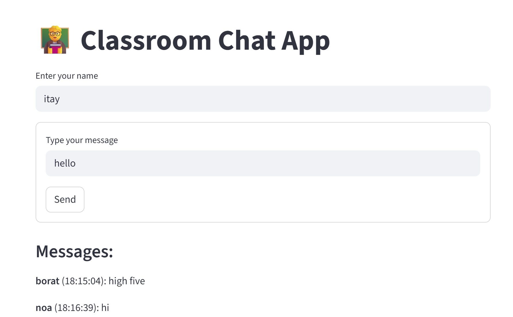

## 🔥 Firebase Firestore: Step-by-Step Setup Tutorial

 This guide shows how to set up a **Cloud Firestore** database in Firebase, use **test mode**, and **download the `serviceAccountKey.json`** for backend or app access.

### ✅ Step 1: Create a Firebase Project

1. Go to [https://console.firebase.google.com](https://console.firebase.google.com)
2. Click **"Add project"**
3. Enter a project name (e.g., `MyFirestoreApp`) and click **Continue**
4. (Optional) Disable Google Analytics if you don't need it
5. Click **Create Project** and wait until it's ready

### 📁 Step 2: Add Firestore Database

1. In your project dashboard, click **"Build" > "Firestore Database"**
2. Click **"Create Database"**
3. Choose the location (e.g., `Tel-Aviv`) and click **Next**
4. Select **Start in test mode** ✅
5. Click **Enable**

> Test mode allows open access for 30 days. Useful for development.

### 🧩 Step 3: Generate the Service Account JSON

1. Go to **Project Settings** (gear icon near Project Overview)
2. Click the **"Service accounts"** tab
3. Click **"Generate new private key"**
4. Confirm and download the `serviceAccountKey.json` file

> 💡 **Move the downloaded file into your Python project folder** and rename it to exactly:
```bash
serviceAccountKey.json
```

> Keep this file private! It gives access to all Firebase services in your project.

### 🧪 Step 4: Connect with Python (Optional Test)

Install Firebase Admin SDK:
```bash
pip install firebase-admin
```

Sample Python script:
```python
import firebase_admin
from firebase_admin import credentials, firestore

# Load credentials
cred = credentials.Certificate("serviceAccountKey.json")
firebase_admin.initialize_app(cred)

# Access Firestore
db = firestore.client()

# Create/write a document
doc_ref = db.collection("users").document("user1")
doc_ref.set({
    "name": "Alice",
    "age": 30,
    "status": "active"
})

print("Document written to Firestore!")
```

### 💬 BONUS: Build a Live Chat App with Streamlit + Firestore



Install requirements:
```bash
pip install streamlit firebase-admin streamlit-autorefresh pytz
```

Save this code as `app.py`:
```python
import streamlit as st
import firebase_admin
from firebase_admin import credentials, firestore
from datetime import datetime
import pytz
from streamlit_autorefresh import st_autorefresh

# Auto-refresh every 2 seconds
st_autorefresh(interval=2000, key="chat-refresh")

# Initialize Firebase
if not firebase_admin._apps:
    cred = credentials.Certificate("serviceAccountKey.json")
    firebase_admin.initialize_app(cred)

db = firestore.client()
messages_ref = db.collection("chat")

# UI
st.title("\U0001F9D1‍🏫 Classroom Chat App")
username = st.text_input("Enter your name")

# Input inside a form to avoid repeated sending
with st.form("chat_form"):
    msg = st.text_input("Type your message")
    send = st.form_submit_button("Send")

    if send and username and msg:
        now = datetime.now(pytz.timezone("Asia/Jerusalem"))
        messages_ref.add({
            "name": username,
            "message": msg,
            "timestamp": now
        })
        st.success("Message sent!")

# Show only last 5 messages
st.subheader("Messages:")
msgs = list(messages_ref.order_by("timestamp", direction=firestore.Query.ASCENDING).stream())
for m in msgs[-5:]:
    data = m.to_dict()
    time_str = data['timestamp'].strftime("%H:%M:%S")
    st.markdown(f"**{data['name']}** ({time_str}): {data['message']}")
```

Run it with:
```bash
streamlit run app.py
```

This will open a browser window where users can chat live using Firebase Firestore!

### 🗂️ Suggested Project Structure

```
my-firestore-chat-app/
├── app.py                   # Streamlit chat app
├── serviceAccountKey.json  # Firebase service account key
├── requirements.txt        # Optional: list of dependencies
└── README.md               # Optional: project documentation
```

> You can create `requirements.txt` with:
```bash
pip freeze > requirements.txt
```


You're now ready to build powerful apps with **Cloud Firestore + Streamlit**! 🚀
